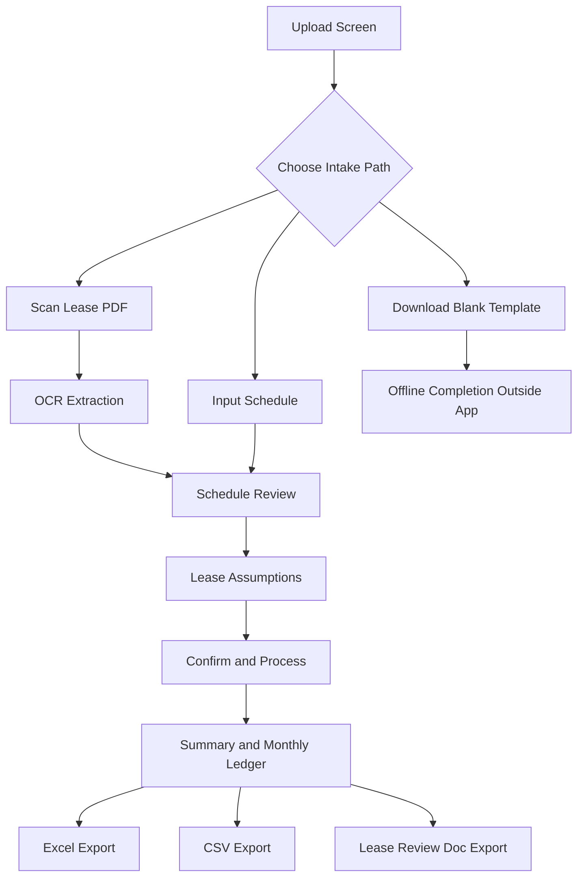
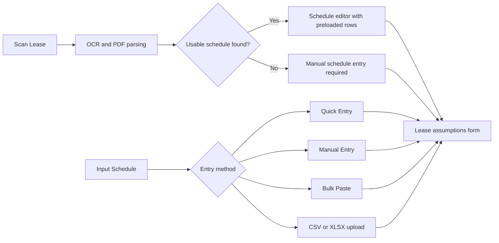
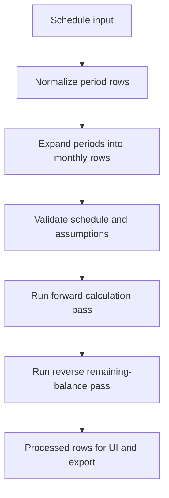
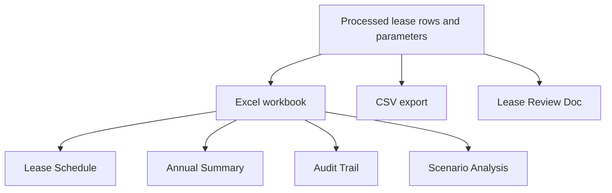
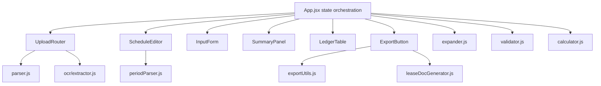

# DEODATE Lease Schedule Engine

## User Manual and App Explanation

Prepared from the `codex/ui-ui-fixes` worktree.

| Item | Value |
| --- | --- |
| Worktree path | `C:\Users\ljen\deodate-lease-app\.codex\worktrees\ui-ui-fixes` |
| Branch | `codex/ui-ui-fixes` |
| Commit | `4931758ef5cfc6e1dbdcfe90ca33055757c9dd8b` |
| As-of date | March 25, 2026 |
| Basis | Source-code review of the current worktree implementation |
| Change scope for this deliverable | Documentation only; no app logic changes |

## 1. Purpose

The DEODATE Lease Schedule Engine is a React single-page application that converts a lease rent schedule plus related lease assumptions into a monthly obligation ledger. The ledger is then available on-screen and through export files.

At the current `ui-ui-fixes` worktree state, the app supports three intake options:

- `Scan Lease`: upload a PDF and let OCR attempt to extract the rent schedule and lease assumptions.
- `Input Schedule`: create or load the rent schedule directly through Quick Entry, manual rows, bulk paste, or structured file upload.
- `Download Blank Excel Template`: download a blank workbook for offline completion.

The application is explicitly human-in-the-loop. Processing does not begin automatically. A user must review the schedule, review the assumptions, and then click `Confirm & Process Schedule`.

## 2. What The App Produces

The current app produces the following outputs after processing:

- An on-screen `Summary` panel with lease dates, obligation totals, and remaining balances.
- An on-screen `Monthly Ledger` with expandable row-level calculation trace.
- An Excel workbook with four sheets:
- `Lease Schedule`
- `Annual Summary`
- `Audit Trail`
- `Scenario Analysis`
- A plain CSV export.
- A Word `Lease Review Doc` export generated from the processed lease.

## 3. Workflow Overview

## 4. Intake Paths

| Intake path | Intended use | What the app does next |
| --- | --- | --- |
| `Scan Lease` | Raw PDF lease, especially when assumptions may be embedded in the document | Runs OCR, scores extraction confidence, prepopulates schedule and assumptions, then routes the user to schedule review |
| `Input Schedule` | User already knows the schedule or has a structured file | Opens the schedule editor for Quick Entry, Manual Entry, Bulk Paste, or file parsing |
| `Download Blank Excel Template` | User wants to complete a template offline first | Downloads a blank `.xlsx` file and does not process anything in-app |

## 5. Step-By-Step User Manual

### 5.1 Upload Screen

The upload screen presents three numbered cards.

#### Scan Lease

- Accepts `.pdf`.
- Supports drag-and-drop and file browse.
- Displays an OCR caution notice for scanned PDFs, image-heavy exhibits, non-standard layouts, and narrative escalation language.
- Uses OCR plus structured PDF parsing in parallel, then prefers the structured parser if it yields rows.

#### Input Schedule

- Opens the schedule editor directly.
- This is the most controlled path when the rent schedule is already known.

#### Download Blank Excel Template

- Downloads `/deodate-lease-template.xlsx`.
- This path is isolated from processing. It does not create assumptions, run calculations, or open results.

### 5.2 Schedule Editor

The schedule editor has two tabs: `Quick Entry` and `Manual Entry`.

#### Quick Entry

Quick Entry asks for four values:

- Lease Commencement Date
- Lease Expiration Date
- Year 1 Monthly Base Rent
- Annual Base Rent Escalation

From those values, the app generates annual rent periods through expiration and shows a preview table before the user continues.

Quick Entry is useful when the lease follows a standard annual escalation structure and a row-by-row manual schedule is not needed.

#### Manual Entry

Manual Entry supports direct row editing and bulk paste.

Accepted period formats in the current app:

| Input example | Meaning |
| --- | --- |
| `3/1/18-2/28/19` | Explicit start and end date |
| `3/1/18 - 2/28/19` | Explicit start and end date |
| `3/1/18` | Start date only; end date inferred from the next row |
| `Year 1` | Relative year label; user still needs actual dates before final processing |

Accepted rent behavior in the current app:

- Dollar signs and commas are stripped during parsing.
- Leading `S` may be treated as an OCR misread of `$`.
- An asterisk on the rent value, such as `$98,463.60*`, is treated as a potential abatement hint.

Two-digit year rule used by the app:

- `00` to `49` becomes `2000` to `2049`
- `50` to `99` becomes `1950` to `1999`

Important schedule editor behaviors:

- If a row has only a start date, the app infers the end date from the next row's start date minus one day.
- The final row still requires an explicit end date to create a complete final period.
- Rows with an asterisk on rent are highlighted and a follow-on abatement hint is shown.
- Bulk paste expects one row per line with period and rent separated by a tab or at least two spaces.

#### Structured File Upload

The file parser accepts:

- `.xlsx`
- `.xls`
- `.csv`
- `.pdf`

For spreadsheets and CSV files, the app fuzzily detects columns that correspond to:

- period start
- period end
- monthly base rent

If no valid schedule rows can be produced, the app routes the user back to manual schedule entry rather than dead-ending.

#### Duplicate Date Handling

If duplicate monthly anchor dates are created during expansion:

- the app surfaces the duplicate dates to the user,
- requires explicit confirmation before processing, and
- uses the later row for each duplicate date after confirmation.

### 5.3 Lease Assumptions Form

The assumptions form is organized into six visible sections.

| Section | What it captures |
| --- | --- |
| `Lease Drivers` | lease name, square footage, schedule-derived commencement and expiration, rent commencement date, effective date of analysis |
| `Monthly Rent Breakdown` | base rent display plus recurring charge amounts |
| `Escalation Assumptions` | annual escalation rates plus optional escalation and billing start dates |
| `Abatement` | abatement months, abatement end date, abatement percentage |
| `Free Rent` | free-rent months or free-rent end date |
| `Non-Recurring Charges` | dated one-time items such as deposits, key money, or credits |

#### Lease Drivers

- `Lease Commencement` and `Lease Expiration` are derived from the confirmed schedule.
- `Rent Commencement Date` is optional and can differ from lease commencement.
- `Effective Date of Analysis` is optional and feeds remaining-balance reporting in the summary panel and workbook.
- `Rentable SF` can be required if OCR determines rent was expressed as `$ / SF`.

#### Monthly Rent Breakdown

The app supports two NNN modes:

- `Individual line items`
- `Aggregate estimate`

In `Individual line items` mode, the user can populate recurring charges such as:

- CAMS
- Insurance
- Taxes
- Security
- Other Items
- Additional custom recurring charges

In `Aggregate estimate` mode:

- one combined NNN amount replaces individual CAMS, Insurance, and Taxes line items for processing,
- other recurring charges can still remain as `Other` type charges, and
- the form clearly indicates that aggregate NNN is being used.

Custom recurring charges are supported in the current worktree. Each recurring charge carries:

- a stable internal key,
- a display label,
- a canonical type of `NNN` or `Other`,
- a Year 1 monthly amount,
- an annual escalation percentage,
- an optional escalation start date,
- an optional billing start date.

#### Escalation Assumptions

For each recurring charge, the form allows:

- annual escalation rate,
- escalation start date,
- billing start date.

If escalation and billing start dates are blank, the app anchors escalation to the lease commencement structure.

#### Abatement

The current app uses an explicit 0 to 100 scale:

- `100` means full abatement
- `50` means half abatement
- `0` means no abatement

The `Abatement End Date` convention is important:

- it is the last day of abatement, inclusive,
- full base rent begins the following day.

#### Free Rent

Free rent is treated as distinct user input, but in calculation terms:

- free rent overrides abatement when both are set,
- free rent is converted to `100%` abatement for the free-rent period.

#### Non-Recurring Charges

The form supports one-time items with:

- label
- date
- amount

Examples include security deposits, key money, or other specific one-time charges. If no date is provided, the calculation engine assigns the item to lease commencement.

### 5.4 Validation, Confidence, and Warning Layers

Before processing, the app can show several warning types:

- OCR confidence warnings
- file parse warnings
- schedule plausibility warnings
- form validation warnings
- duplicate-date confirmation warnings

The app blocks processing on validation errors, but not on warnings.

The plausibility checks currently look for:

- gaps greater than 31 days between periods
- overlapping periods
- negative or unusually large rent values
- dates outside a 1970 to 2070 plausibility range
- lease terms longer than 30 years or shorter than one month
- unusual escalation jumps, such as increases above 15 percent

### 5.5 Confirm And Process

Processing begins only when the user clicks `Confirm & Process Schedule`.

That action:

- validates the schedule and assumptions,
- converts form state to calculator parameters,
- runs the calculation engine, and
- routes the user to the results screen.

## 6. Results Screen

The results screen has three core areas:

- export actions,
- summary metrics,
- monthly ledger.

### 6.1 Summary Panel

The summary panel shows:

- lease start
- lease expiration
- total months
- scheduled versus applied base rent
- total base rent
- total recurring charge totals
- total one-time charges
- total other charges
- total NNN obligation
- combined total obligation

It also supports an `As of` date selector for remaining balances. When a date is selected, the app locates the first future row and reports remaining:

- total obligation
- NNN obligation
- base rent obligation

### 6.2 Monthly Ledger

The ledger is paginated and scrollable. Each row shows:

- period start
- period end
- lease year number
- lease month number
- scheduled base rent
- base rent applied
- abatement amount
- proration factor
- recurring charge columns
- total NNN
- one-time charges
- other charges
- total monthly obligation
- effective dollars per square foot
- remaining obligation columns

Amber-highlighted rows indicate periods that fall entirely within abatement.

Each ledger row can be expanded to reveal a calculation trace.

### 6.3 Calculation Trace

The trace panel surfaces how a row was calculated. It includes:

- period factor
- base rent proration factor
- whether proration was a full month, abatement boundary, or final-month proration
- per-charge escalation year index
- whether a charge was inactive because its billing start date had not yet been reached
- label-classification trace when OCR-derived expense labels were classified

## 7. How The App Calculates The Ledger

### 7.1 Schedule Normalization

The app works from canonical period rows shaped as:

- `periodStart`
- `periodEnd`
- `monthlyRent`

Those period rows may originate from:

- OCR results,
- spreadsheet or CSV parsing,
- manual entry,
- bulk paste,
- Quick Entry generation.

### 7.2 Monthly Expansion

The expander converts each period into monthly anchor rows.

Important current behaviors:

- rows are expanded month by month using anchored monthly dates,
- the final expanded row may retain the explicit period end for final-month proration,
- duplicate dates are surfaced and then deduplicated using last-write-wins behavior after confirmation,
- the app assigns `Month #` and `Year #` after sorting.

### 7.3 Base Rent And Abatement Logic

The current calculation engine applies:

- a `period factor` for final partial months,
- a `base rent proration factor` for abatement logic,
- a combined factor for the actual base rent applied to a row.

Abatement applies to base rent only in the current implementation. NNN charges are not abated by the abatement logic.

There are four core base-rent cases:

1. No abatement configured: full base rent applies.
2. Entire period falls within abatement: tenant pays the reduced fraction.
3. Period straddles the abatement boundary: the app blends abated days and full-rent days.
4. Entire period falls after abatement: full base rent applies.

### 7.4 Recurring Charges

Recurring charges are calculated per row using:

- Year 1 monthly amount,
- annual escalation rate,
- optional explicit escalation start date,
- optional billing start date,
- row period factor.

If a charge is not yet active because its billing start date has not been reached, the row trace marks that charge as inactive.

### 7.5 NNN Versus Other Charges

The current app distinguishes between:

- charges that roll into `Total NNN`,
- charges that roll into `Other Charges`.

In the dynamic charge model:

- charges tagged as canonical `NNN` contribute to `Total NNN`,
- charges tagged as canonical `Other` contribute to `Other Charges`.

This classification affects both the ledger columns and the remaining-balance totals.

### 7.6 One-Time Items

One-time items are assigned to a month by date.

Current assignment behavior:

- if the item date falls within a row period, that row receives the amount,
- if the date is blank, the first row receives the amount,
- if the date is before lease start, the first row receives the amount,
- if the date is after lease end, the last row receives the amount.

### 7.7 Remaining Balances

The app calculates remaining balances in a reverse pass. Starting from the last row and moving backward, it accumulates:

- total monthly obligation remaining
- total NNN remaining
- total base rent remaining
- total other charges remaining

These are tail sums, not discounted present values.

## 8. OCR And Confidence Model

The current OCR path:

- accepts a PDF,
- checks whether the PDF is likely scanned,
- sends the file to the configured OCR provider,
- parses the returned JSON extraction payload,
- computes field-level and overall confidence,
- routes the user to schedule review rather than auto-processing.

The extractor can use:

- Anthropic as the primary provider
- OpenAI as an optional configured provider and fallback

Confidence scoring currently considers:

- schedule completeness,
- rent value validity,
- number of OCR confidence flags,
- provider-reported confidence,
- presence of NNN data,
- date validity in the parsed schedule.

If the PDF appears scanned or image-based, the app lowers confidence and adds review notices.

## 9. Export Package Explanation

### 9.1 Excel Workbook

At the current `ui-ui-fixes` worktree state, the Excel export builds four sheets.

| Sheet | Purpose |
| --- | --- |
| `Lease Schedule` | Main monthly ledger plus assumptions block and formulas |
| `Annual Summary` | Year-by-year rollup using cross-sheet formulas |
| `Audit Trail` | Row-level trace and supporting detail |
| `Scenario Analysis` | Current remaining obligations, renegotiation scenarios, and exit scenarios |

Important workbook characteristics:

- dynamic columns are driven by active recurring charge categories,
- `Total NNN` is kept separate from `Other Charges`,
- one-time items are represented as non-recurring charges,
- color conventions distinguish hard-coded inputs, formulas, cross-sheet formulas, and abatement rows.

### 9.2 CSV Export

The CSV export is a flatter output. It includes key ledger columns and remaining-balance columns, but it does not preserve the styled workbook behavior.

### 9.3 Lease Review Doc

The app can also export a Word document named as a lease review document. The generator in the current worktree builds a narrative document that covers:

- lease overview
- extracted terms
- unusual provisions
- assumptions
- warnings and confidence notes
- workbook interpretation guidance
- fields to verify manually
- formula-driven versus assumption-driven values
- common correction scenarios

## 10. Current Implementation Notes That Matter Operationally

The following points are important for users and reviewers of the current worktree:

- Processing never begins automatically.
- The app is resilient to OCR or parser failure and routes the user to manual schedule entry instead of failing closed.
- Free rent takes precedence over abatement and is implemented as 100 percent abatement for the free-rent window.
- Abatement end date is inclusive.
- Duplicate period start dates require explicit confirmation before processing.
- Remaining balances shown in the main UI are not discounted values.
- The workbook export contains scenario-analysis logic that is broader than what is shown on the main results screen.

## 11. Recommended User Operating Sequence

1. Choose the intake path that best matches the source material.
2. Confirm that the rent schedule periods and monthly rent amounts are correct.
3. Review warnings, plausibility messages, and any OCR low-confidence flags.
4. Complete the assumptions form, including recurring charges, abatement, free rent, and one-time items.
5. Click `Confirm & Process Schedule`.
6. Review the summary totals and spot-check several ledger rows using the trace panel.
7. Export the Excel workbook for analysis and the Word review document for narrative support when needed.

## 12. Technical Architecture Summary

The current app is implemented as:

- React 18 functional components
- Vite
- Tailwind CSS
- `pdfjs-dist` for PDF text extraction support
- `papaparse` for CSV parsing
- `xlsx-js-style` for workbook generation
- `docx` for Word-document generation

The root component is `App.jsx`, which owns the workflow state. Calculation logic is kept in pure engine modules, and exports are generated from processed rows plus normalized parameters.

## 13. Limitations And Boundaries

This manual reflects the app as implemented in the inspected worktree on March 25, 2026. It does not indicate that every workflow has been independently user-accepted or regression-tested beyond the code paths reviewed.

The current app indicates the following practical boundaries:

- OCR quality can be reduced for scanned PDFs, image-heavy exhibits, or non-standard layouts.
- Square footage is necessary when rent is expressed as a rate per square foot and the app must derive dollar amounts.
- Structured file parsing depends on column detection and may require manual schedule cleanup.
- The main UI focuses on ledger production and review; deeper scenario modeling is delivered in the workbook export rather than in the on-screen results view.

## 14. Mermaid Diagram Index

The companion Word document cannot render Mermaid natively. The editable Mermaid source is preserved in this Markdown file for future revision.

Included diagrams:

- Overall workflow overview
- Intake-path decision flow
- Calculation pipeline
- Export package structure
- Technical architecture map
